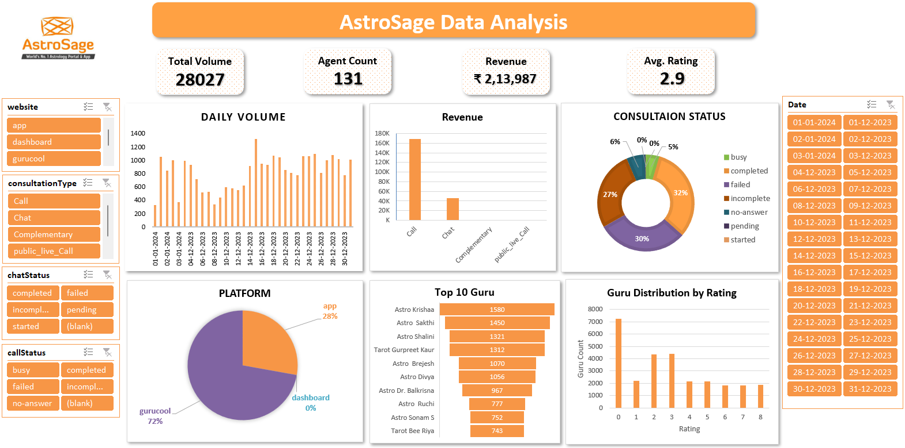

# AstroSage Data Analysis — Excel Dashboard

## 🚀 Overview

This project provides an end-to-end operational analysis of the AstroSage platform using **Microsoft Excel**. It converts raw historical consultation data into actionable insights that help evaluate performance, profitability, customer satisfaction, and operational efficiency. The dashboard empowers business leaders to make strategic, data-driven decisions for scaling AstroSage’s services.

---

## 📌 Project Objective & Background

AstroSage is one of India’s largest astrology consultation platforms, offering services through calls, chats, and app-based interactions. With increasing customer engagement and platform expansion, AstroSage planned a **₹1 Crore investment** to enhance technology infrastructure and operational capacity. To justify this investment, a detailed analysis of customer behavior, agent performance, and revenue contribution was required.

---

## 🎯 Objective

**Optimize call center operations to improve efficiency, customer satisfaction, and profitability.**

The goal was to uncover platform usage patterns, evaluate service quality, identify top-performing astrologers, and pinpoint operational bottlenecks that restrict revenue growth.

---

## 🧩 Problem Statement

Despite high traffic and strong business potential, AstroSage faced critical challenges:

| Challenge Area | Observation |
|----------------|------------|
| **Low Customer Satisfaction** | Average rating of **2.9** suggests dissatisfaction |
| **High Failed/Pending Consultations** | Large volume of incomplete, no-answer, and pending sessions |
| **Agent Performance Gaps** | Significant variability in astrologer ratings and consultation counts |
| **Single-Platform Dependency** | **72% traffic** coming from *Gurucool* creates operational risk |
| **Unclear Revenue Drivers** | Lack of visibility into which consultation types are most profitable |

These challenges reduced operational efficiency, hampered customer trust, and increased churn risk.

---

## 📊 Dashboard Preview

This interactive Excel dashboard centralizes all KPIs, trends, and segments with slicers allowing leaders to explore the data dynamically.

---

## 🔍 Scope of Analysis

The dashboard answers mission-critical business questions through:

- Daily volume tracking to understand customer demand cycles
- Revenue distribution by consultation type (Call, Chat, Complementary, Public Live Call)
- Platform adoption patterns (App, Gurucool, Dashboard)
- Consultation status breakdown (Completed, Failed, Busy, No-Answer, Pending, etc.)
- Guru (astrologer) performance and ratings
- Customer experience metrics and quality signals

---

## 🧠 Key Insights

| Insight | Interpretation |
|--------|---------------|
| **Calls generate the highest revenue** | Real-time voice consultations are preferred over chats |
| **Gurucool dominates usage (72%)** | Investment must prioritize this platform for scalability |
| **Top astrologers drive most bookings** | A stratified incentive model can increase conversions |
| **High pending/failed rates** | Indicates process inefficiencies and revenue leakage |
| **Average rating of 2.9** | Customer dissatisfaction requires service quality improvements |

---

## 🏆 Business Value Delivered

✔ Provided data-backed clarity for a **₹1 Crore investment** plan  
✔ Identified operational inefficiencies impacting profitability  
✔ Highlighted agent performance discrepancies and skill gaps  
✔ Revealed customer behavior trends for targeted platform improvements  
✔ Enabled leadership to monitor KPIs without manual reporting  

This analysis elevated decisions from **intuition-driven** to **insight-driven**.

---

## 📈 Dashboard Features

- **Interactive slicers** for date, consultation type, status, and website
- **KPI cards** for total volume, revenue, agent count, and rating
- **Visuals** including bar charts, pie charts, and trend analysis
- **Automated transformation logic** enabling quick refresh
- **Single-file Excel solution** without external BI tools

---

## 🛠 Tech Stack

- **Excel**
- **Pivot Tables**
- **Charts and Slicers**
- **Conditional Formatting**
- **Data Cleaning & Transformation**

---

## 🗂 Folder Structure

